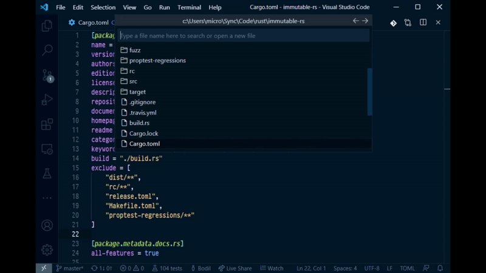

# File Browser

An integrated, keyboard driven file selector for VS Code, inspired by Emacs's
[Helm](https://emacs-helm.github.io/helm/) file selector.

## Features

This is what this extension gives you:

-   A fully keyboard driven file open dialog: bind `file-browser.open` to `Ctrl+O` (or `C-x C-f` if
    you're an Emacs expat) and enjoy the lack of OS file dialog clutter.
-   Start typing a file name to quickly find it in the current folder.
-   Automatically create files and folders just by typing their names and selecting the option that
    appears.
-   Easy navigation in and out of folders by using the left and right arrow keys.
-   Navigate to your home folder by typing `~/` into the search box.
-   Perform file operations like rename and delete by stepping into a file with the right arrow key,
    or by hitting "Ctrl+A" on any file or folder.

## Licence

Copyright 2020 Bodil Stokke

This program is free software: you can redistribute it and/or modify it under the terms of the GNU
Lesser General Public License as published by the Free Software Foundation, either version 3 of the
License, or (at your option) any later version.

This program is distributed in the hope that it will be useful, but WITHOUT ANY WARRANTY; without
even the implied warranty of MERCHANTABILITY or FITNESS FOR A PARTICULAR PURPOSE. See the GNU
General Public License for more details.

You should have received a copy of the GNU Lesser General Public License along with this program. If
not, see https://www.gnu.org/licenses/.

## Code of Conduct

Please note that this project is released with a [Contributor Code of Conduct][coc]. By
participating in this project you agree to abide by its terms.

[coc]: https://github.com/bodil/vscode-file-browser/blob/master/CODE_OF_CONDUCT.md
